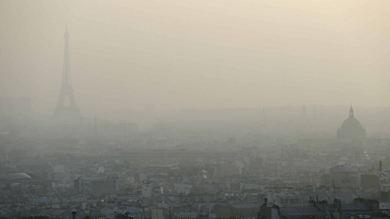
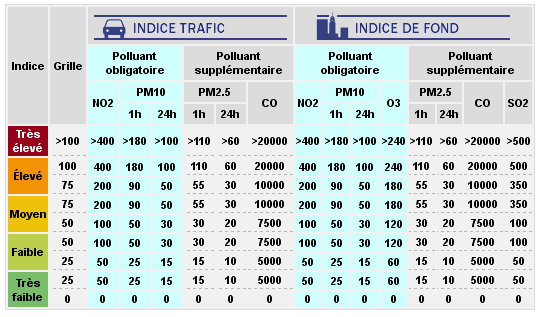

```{r setup, include=FALSE}
knitr::opts_chunk$set(echo = TRUE, 
                      include = TRUE,
                      message = FALSE,
                      warning = FALSE)
#library(lubridate)
library(tidyverse)
theme_set(theme_bw())

```

# Why visual EDA?

Example: Anscombe's quartet

```{r anscombe, include=FALSE}

anscombe

```

```{r calc anscombe stats, include=FALSE}

# calc mean and standard dev
mean = round(apply(anscombe,2, mean),3)
std_dev = round(apply(anscombe,2, sd), 3)

# create df of stats
anscombe_stats <- rbind(mean, std_dev) 

```

```{r show stats, echo=FALSE}

anscombe_stats

```

```{r convert to long df, include=FALSE}

# create long df of anscombe data
mydata=with(anscombe,data.frame(xVal=c(x1,x2,x3,x4), 
                                yVal=c(y1,y2,y3,y4),
                                mygroup=gl(4,nrow(anscombe))))

```

# Anscombe's quartet, visualized

```{r plot mydata, echo=FALSE}

ggplot(data = mydata, aes(x = xVal, y = yVal, shape = mygroup)) +
  geom_point(size = 3, colour = 'blue') +
  facet_wrap(~mygroup)

```


# Why R?

* open-source
* mature ecosystem
* easy to share work
* fantastic IDE

≠# Why Ggplot2?

<<<<<<< HEAD


It's all about *layers*.

# Explore Paris air quality


=======


```{r air pollution in paris Oct 2017, include=FALSE}

airparif <- read_rds("airparif_oct2017.rds")
str(airparif)

# make tidy
airparif.tidy <- airparif %>% 
  gather(PM10, PM25, NO2, O3, CO, 
         key = 'pollutant', value = 'value', 
         na.rm = TRUE) %>% 
  group_by(date, heure, pollutant) %>% 
  arrange(date)

airparif.tidy <- data.frame(airparif.tidy)
str(airparif.tidy)

```


# What are we looking at?

<<<<<<< HEAD


```{r get names}

tail(airparif.tidy)

```

* `PM25` = Particulate matter < 2.5 µm
* `PM10` = Particulate matter < 10 µm
* `O3` = Ozone
* `NO2` = Nitrogen Dioxide (Azote)
* `CO` = Carbon monoxide

# Plot layer by layer

What is the shape of the data?

```{r plot all pollutants}

# create plot
hg <- ggplot(data = airparif.tidy, aes(x = value))
hg 

# add geom
hg <- hg + geom_histogram(stat = 'count')
hg

# add facets
hg + 
  facet_wrap(~pollutant)

# fix x-axis
hg + facet_wrap(~pollutant, scales = 'free_x')

```

# Tip 1: Use tidy data

*Not tidy*

```{r not tidy, echo=FALSE}

head(airparif)

```

*Tidy*
 
```{r, echo=FALSE}

head(airparif.tidy)

```

* observations in rows
* variables are columns
* values in cells


#Tip 2: Update data with `%+%` operator

Will colour make pollutants easier to differentiate?

```{r update aes}

# update data layer with new mapping
hg <- hg %+% aes(fill = pollutant)

# plot
hg + facet_wrap(~pollutant, scales = 'free_x')
```


# Facet by 2 variables

Do distributions change from month to month?

```{r facet grid}

hg + facet_grid(month~pollutant, scales = 'free_x')

```


# Another view of distributions

How do the values change over the year?

```{r boxplot}

# create boxplot var
bp <- ggplot(airparif.tidy, aes(month, value, fill = pollutant)) +
  geom_boxplot()

# we'll use this a lot  
fw <- facet_wrap(~pollutant, scales = 'free_y')

# monthly boxplot
bp + fw

# hourly boxplot
bp.h <- bp %+% aes(x = as.factor(heure)) 

bp.h + fw

```

# Add more data

How bad are these pollution spikes?




```{r show hourly pollution levels, include=FALSE}

# first, define thresholds for diff pollutants
PM10 <- c(25,50,90,180)
PM25 <- c(15,30,55,110)
NO2 <- c(50,100,200,400)
O3 <- c(60,120,180,240)
CO <- c(5000,7500, 10000, 20000)

# create df of levels
levels_h.df <- as.data.frame(cbind(PM10, PM25, NO2, O3, CO))
rownames(levels_h.df) <- c('low', 'medium', 'high', 'very high')

# set rownames as columns
library(data.table)
setDT(levels_h.df, keep.rownames = TRUE)

# rename rn column
colnames(levels_h.df)[1] <- "level"

# put in long format
levels_h.long <- levels_h.df %>% 
  gather('pollutant', 'value', 2:6)

# change col order
levels_h.long <- levels_h.long[, c(2,3,1)]

```


```{r bp with pollution levels}

# add horizontal line & levels df
hl <- geom_hline(data = levels_h.long, 
                  aes(yintercept = value, group = pollutant), linetype = 2)

# without hlines
bp.h + fw

# with hlines
bp.h + fw + hl

```


# Create correlation grid

How correlated are the different pollutants?

```{r}

# create a sample of 1000 obs

set.seed(888) 
sample <- subset(airparif, select = c(PM10, PM25, NO2, O3, CO, year))
sample <- sample[sample(1:nrow(sample),1000),]

```

```{r ggpairs}

# import library
library(GGally) 

# look at correlations
ggpairs(data=sample, # data.frame with variables
        title="Pollutant correlations") # title of the plot

```

```{r add alpha and trendline}

ggpairs(data = sample, 
        lower = list(continuous = wrap("smooth", alpha=1/5, shape = I('.'), 
                                       colour ='blue')),
         title="Pollutant correlations")

```

# Bonus: Heatmap

Which months have the lowest pollution?

```{r heatmap munging, include=FALSE}

# summarize df
ap.tidy.agg <- airparif.tidy %>% 
  group_by(date, pollutant) %>% 
  summarise(mean = mean(value))


# make wide df
ap.agg <- ap.tidy.agg %>%
  spread(pollutant, mean)

# scale by centering around mean
# for that pollutant
ap.scaled <- sapply(ap.agg[2:6], function(x) scale(x))

# convert to df
ap.scaled <- as.data.frame(ap.scaled)

# add back date
ap.scaled$date <- ap.agg$date

# make tidy
ap.scaled.tidy <- ap.scaled %>% 
  group_by(date) %>% 
  gather(key = 'pollutant', value = 'scale_value', 1:5) %>% 
  arrange(date)

head(ap.scaled.tidy)

```

```{r data munge hourly data, include=FALSE}

# data munging

# scale by centering around mean
# for that pollutant
ap.h.scaled <- sapply(airparif[6:10], function(x) scale(x))

# convert to df
ap.h.scaled <- as.data.frame(ap.h.scaled)

# add back date & hour
ap.h.scaled$date <- airparif$date
ap.h.scaled$hour <- airparif$heure

# make tidy
ap.h.scaled.tidy <- ap.h.scaled %>% 
  group_by(date, hour)%>% 
  gather(key = 'pollutant', value = 'scale_value', 1:5) %>% 
  arrange(date)

head(ap.h.scaled.tidy)

```

```{r month heatmap}

# data layer
hm <- ggplot(data = ap.scaled.tidy, 
             aes(x = pollutant, y = as.factor(month(date))))

# add geom
hm <- hm +
  geom_tile(aes(fill = scale_value))
  
# add colour scale & plot
hm + scale_fill_gradient2(low="blue", high="darkorange", guide="colorbar")


```

Which hours of the day are the least polluted?

```{r hourly heatmap}

# update df and y var
hm.h <- hm %+% ap.h.scaled.tidy + aes(y=hour)

# add colour scale & plot
hm.h + scale_fill_gradient2(low="blue", high="darkorange", guide="colorbar")

```

# Bonus: Grouping

How did pollution fluctuate throughout the day?

```{r filter on dec 2016, include=FALSE}

dec2016 <- airparif.tidy %>% 
  filter(year == 2016 & month == 12)

dec2016 <- data.frame(dec2016)
```

```{r line plot}

# create line plot
p <- ggplot(dec2016, aes(heure, value)) +
              geom_line(colour = 'darkgrey')
p + fw

# change default grouping
p <- p %+% aes(group = date)
p + fw

```

## Highlight a single line

When did particulate pollution spike?

```{r filter data}

# Dec 2016 particulate data
dec2016_pm <- dec2016 %>% 
  filter(pollutant %in% c('PM10', 'PM25'))

# find index of max value in Dec
max_val <- which.max(dec2016_pm[,'value'])

# find date
max_date <- dec2016_pm[max_val, 'date']

# filter on this date
dec2016_pm_max <- dec2016 %>%
  filter(date == max_date)

```

Was it a big spike for the other pollutants?

```{r plot max PM10 day}

# pollution spike df
p_spike <- geom_line(aes(heure, value, 
                         group = pollutant, 
                         colour = pollutant))

# plot pollution spike day
ggplot(data = dec2016_pm_max) + 
  p_spike + 
  fw

# create layer for other days
p_other <- geom_line(data = dec2016, 
                      aes(heure, value, group = date), 
                      colour = 'darkgrey')

# combine & plot
spag <- ggplot(data = dec2016_pm_max) + 
  p_other + 
  p_spike + 
  fw

spag

# add threshold lines
spag + hl

```


<!-- ## Zoom in -->

<!-- Beware of reducing axis range with distributions. -->

<!-- ```{r coord_cartesian} -->

<!-- # no -->
<!-- bp + fw + scale_y_continuous(limits = c(0,75)) -->

<!-- # yes -->
<!-- bp + fw + coord_cartesian(ylim = c(0,75)) -->

<!-- ``` -->

# Recap - to visualize groups:

* tidy dataframes
* map group vars to `aes()`
* `facet_wrap` & `facet_grid`

# Recap - to see correlations:

* `ggpairs` correlation matrix
* `geom_tile` heatmaps

# Recap - to iterate quickly:

* update data layer with `%+%`
* save frequently-used layers as variables

# Learn more

Cookbook for R - Graphs: http://www.cookbook-r.com/Graphs/

Ggplots cheatsheet: http://www.rstudio.com/wp-content/uploads/2015/03/ggplot2-cheatsheet.pdf

Ggally tutorial: http://koaning.io/ggally-explore-all-the-things.html

Data wrangling with Dplyr & Tidyr: https://s3.amazonaws.com/udacity-hosted-downloads/ud651/DataWranglingWithR.pdf


