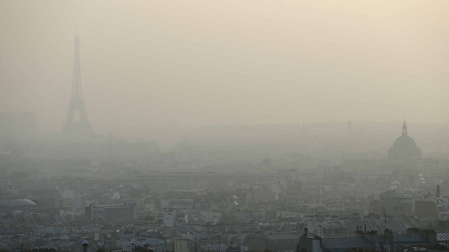
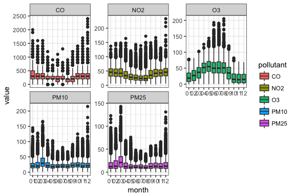
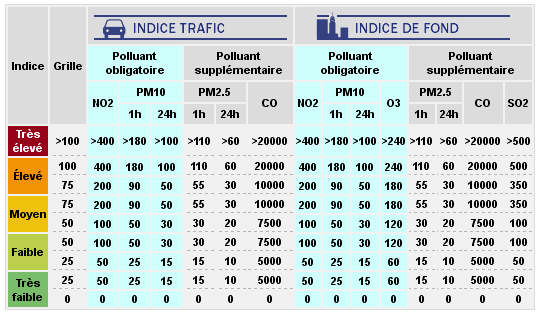

Exploratory Data Analysis with R Ggplot2
================
Sarah Hosking
October 19, 2017

Why visual EDA?
===============

Example: Anscombe's quartet

    ##            x1    x2    x3    x4    y1    y2   y3    y4
    ## mean    9.000 9.000 9.000 9.000 7.501 7.501 7.50 7.501
    ## std_dev 3.317 3.317 3.317 3.317 2.032 2.032 2.03 2.031

Anscombe's quartet, visualized
==============================


Why R?
======

-   open-source
-   mature ecosystem
-   easy to share work
-   fantastic IDE

Why Ggplot2?
============


It's all about *layers*.

Explore Paris air quality
=========================


==============================

What are we looking at?
=======================


``` r
tail(airparif.tidy)
```

    ##              date heure year month day pollutant value
    ## 245615 2017-08-13    19 2017    08  13        CO   300
    ## 245616 2017-08-13    20 2017    08  13        CO   500
    ## 245617 2017-08-13    21 2017    08  13        CO   300
    ## 245618 2017-08-13    22 2017    08  13        CO   300
    ## 245619 2017-08-13    23 2017    08  13        CO   300
    ## 245620 2017-08-13    24 2017    08  13        CO   200

-   `PM25` = Particulate matter &lt; 2.5 µm
-   `PM10` = Particulate matter &lt; 10 µm
-   `O3` = Ozone
-   `NO2` = Nitrogen Dioxide (Azote)
-   `CO` = Carbon monoxide

Plot layer by layer
===================

What is the shape of the data?

``` r
# create plot
hg <- ggplot(data = airparif.tidy, aes(x = value))
hg 
```


``` r
# add geom
hg <- hg + geom_histogram()
hg
```


``` r
# add facets
hg + 
  facet_wrap(~pollutant)
```


``` r
# fix x-axis
hg + facet_wrap(~pollutant, scales = 'free_x')
```


Tip 1: Use tidy data
====================

*Not tidy*

    ##         date heure PM25 PM10 NO2 O3 CO year month day
    ## 2 2011-07-21     1   NA    7  12 NA NA 2011    07  21
    ## 3 2011-07-21     2   NA    6  10 NA NA 2011    07  21
    ## 4 2011-07-21     3   NA    7  10 NA NA 2011    07  21
    ## 5 2011-07-21     4   NA    7  14 NA NA 2011    07  21
    ## 6 2011-07-21     5   NA   10  30 NA NA 2011    07  21
    ## 7 2011-07-21     6   NA   10  36 NA NA 2011    07  21

*Tidy*

    ##         date heure year month day pollutant value
    ## 1 2011-07-21     1 2011    07  21      PM10     7
    ## 2 2011-07-21     2 2011    07  21      PM10     6
    ## 3 2011-07-21     3 2011    07  21      PM10     7
    ## 4 2011-07-21     4 2011    07  21      PM10     7
    ## 5 2011-07-21     5 2011    07  21      PM10    10
    ## 6 2011-07-21     6 2011    07  21      PM10    10

-   observations in rows
-   variables are columns
-   values in cells

Tip 2: Update data with `%+%` operator
======================================

Will colour make pollutants easier to differentiate?

``` r
# update data layer with new mapping
hg <- hg %+% aes(fill = pollutant)

# plot
hg + facet_wrap(~pollutant, scales = 'free_x')
```


Facet by 2 variables
====================

Do distributions change from month to month?

``` r
hg + facet_grid(month~pollutant, scales = 'free_x')
```


Another view of distributions
=============================

How do the values change over the year?

``` r
# create boxplot var
bp <- ggplot(airparif.tidy, aes(month, value, fill = pollutant)) +
  geom_boxplot()

# we'll use this a lot  
fw <- facet_wrap(~pollutant, scales = 'free_y')

# monthly boxplot
bp + fw
```



``` r
# hourly boxplot
bp.h <- bp %+% aes(x = as.factor(heure)) 

bp.h + fw
```


Add more data
=============

How bad are these pollution spikes?



``` r
# add horizontal line & levels df
hl <- geom_hline(data = levels_h.long, 
                  aes(yintercept = value, group = pollutant), linetype = 2)

# without hlines
bp.h + fw
```


``` r
# with hlines
bp.h + fw + hl
```


Create correlation grid
=======================

How correlated are the different pollutants?

``` r
# create a sample of 1000 obs

set.seed(888) 
sample <- subset(airparif, select = c(PM10, PM25, NO2, O3, CO, year))
sample <- sample[sample(1:nrow(sample),1000),]
```

``` r
# import library
library(GGally) 

# look at correlations
ggpairs(data=sample, # data.frame with variables
        title="Pollutant correlations") # title of the plot
```


``` r
ggpairs(data = sample, 
        lower = list(continuous = wrap("smooth", alpha=1/5, shape = I('.'), 
                                       colour ='blue')),
         title="Pollutant correlations")
```


Bonus: Heatmap
==============

Which months have the lowest pollution?

``` r
# data layer
hm <- ggplot(data = ap.scaled.tidy, 
             aes(x = pollutant, y = as.factor(month(date))))

# add geom
hm <- hm +
  geom_tile(aes(fill = scale_value))
  
# add colour scale & plot
hm + scale_fill_gradient2(low="blue", high="darkorange", guide="colorbar")
```


Which hours of the day are the least polluted?

``` r
# update df and y var
hm.h <- hm %+% ap.h.scaled.tidy + aes(y=hour)

# add colour scale & plot
hm.h + scale_fill_gradient2(low="blue", high="darkorange", guide="colorbar")
```


Bonus: Grouping
===============

How did pollution fluctuate throughout the day?

``` r
# create line plot
p <- ggplot(dec2016, aes(heure, value)) +
              geom_line(colour = 'darkgrey')
p + fw
```


``` r
# change default grouping
p <- p %+% aes(group = date)
p + fw
```


Highlight a single line
-----------------------

When did particulate pollution spike?

``` r
# Dec 2016 particulate data
dec2016_pm <- dec2016 %>% 
  filter(pollutant %in% c('PM10', 'PM25'))

# find index of max value in Dec
max_val <- which.max(dec2016_pm[,'value'])

# find date
max_date <- dec2016_pm[max_val, 'date']

# filter on this date
dec2016_pm_max <- dec2016 %>%
  filter(date == max_date)
```

Was it a big spike for the other pollutants?

``` r
# pollution spike df
p_spike <- geom_line(aes(heure, value, 
                         group = pollutant, 
                         colour = pollutant))

# plot pollution spike day
ggplot(data = dec2016_pm_max) + 
  p_spike + 
  fw
```


``` r
# create layer for other days
p_other <- geom_line(data = dec2016, 
                      aes(heure, value, group = date), 
                      colour = 'darkgrey')

# combine & plot
spag <- ggplot(data = dec2016_pm_max) + 
  p_other + 
  p_spike + 
  fw

spag
```


``` r
# add threshold lines
spag + hl
```


<!-- ## Zoom in -->
<!-- Beware of reducing axis range with distributions. -->
<!-- ```{r coord_cartesian} -->
<!-- # no -->
<!-- bp + fw + scale_y_continuous(limits = c(0,75)) -->
<!-- # yes -->
<!-- bp + fw + coord_cartesian(ylim = c(0,75)) -->
<!-- ``` -->
Recap - to visualize groups:
============================

-   tidy dataframes
-   map group vars to `aes()`
-   `facet_wrap` & `facet_grid`

Recap - to see correlations:
============================

-   `ggpairs` correlation matrix
-   `geom_tile` heatmaps

Recap - to iterate quickly:
===========================

-   update data layer with `%+%`
-   save frequently-used layers as variables

Learn more
==========

Cookbook for R - Graphs: <http://www.cookbook-r.com/Graphs/>

Ggplots cheatsheet: <http://www.rstudio.com/wp-content/uploads/2015/03/ggplot2-cheatsheet.pdf>

Ggally tutorial: <http://koaning.io/ggally-explore-all-the-things.html>

Data wrangling with Dplyr & Tidyr: <https://s3.amazonaws.com/udacity-hosted-downloads/ud651/DataWranglingWithR.pdf>
